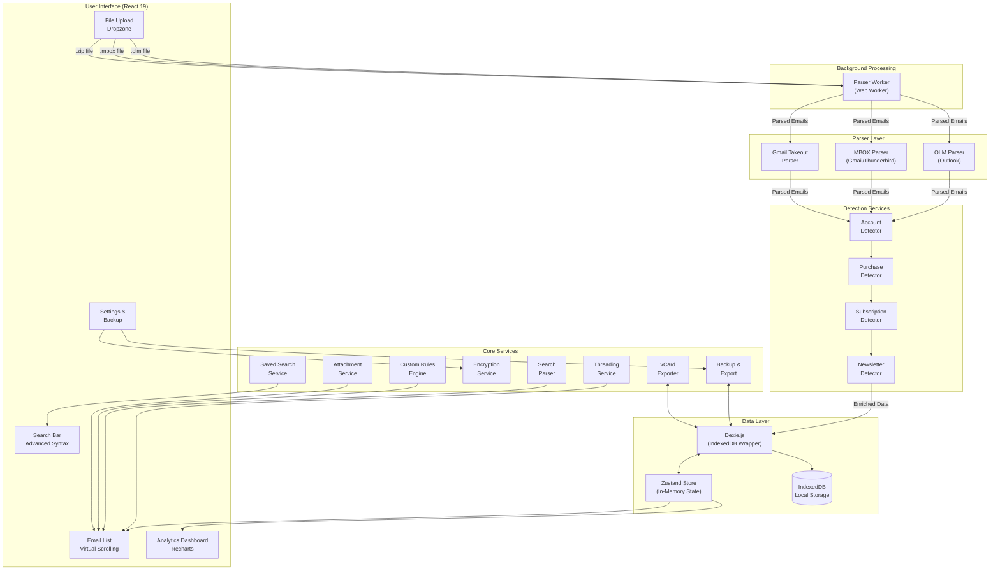
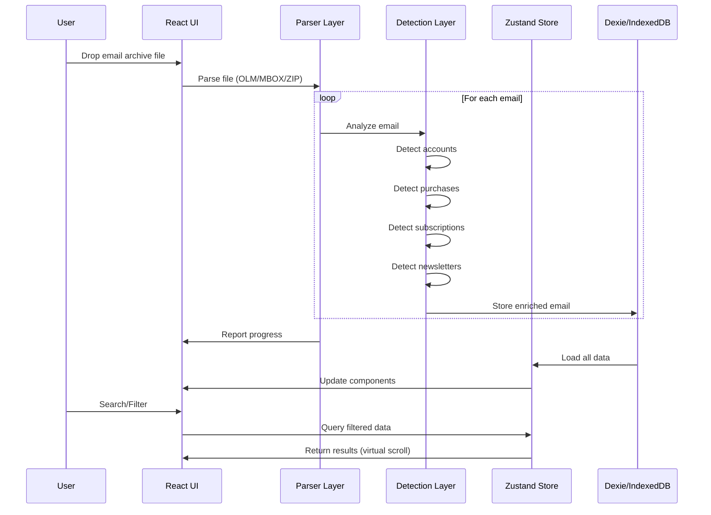

# Architecture

## System Overview

## Data Flow Architecture

## Key Architecture Decisions

### 1. Privacy-First Design

I made privacy the core architectural principle. All data processing happens entirely in the browser using client-side JavaScript. The application never sends email data to any server, which eliminates privacy concerns for users handling sensitive personal or business emails.

**Trade-off**: This limits some potential features like server-side full-text search or AI-powered categorization, but users trust the application more knowing their data never leaves their device.

### 2. IndexedDB with Dexie.js

I chose IndexedDB as the storage layer because it provides persistent local storage that can handle large datasets (tens of thousands of emails). Dexie.js wraps IndexedDB with a cleaner Promise-based API and adds features like:

- Compound indexes for efficient queries
- Schema versioning for migrations
- Bulk operations for faster imports

**Why not localStorage**: LocalStorage has a 5-10MB limit and is synchronous, which would freeze the UI during operations. IndexedDB can store hundreds of megabytes asynchronously.

### 3. Zustand for State Management

I selected Zustand over Redux or Context API for several reasons:

- Minimal boilerplate compared to Redux
- No provider wrapper needed (unlike Context)
- Built-in selectors prevent unnecessary re-renders
- Simple synchronization between IndexedDB and UI state

The store acts as an in-memory cache of **header rows** — subject, sender, dates, flags, tags — so list views and charts have instant access without re-querying IndexedDB. Heavy payloads (full body, HTML, attachment data) and the per-message search text stay in the database and are fetched on demand, keeping the resident set small even for large archives.

### 4. Virtual Scrolling with TanStack Virtual

For email archives with thousands of messages, I implemented virtual scrolling to render only visible items. This keeps memory usage constant regardless of dataset size and maintains 60fps scrolling performance.

### 5. Detection Pipeline

The detection services run as a pipeline during import rather than on-demand. This design:

- Front-loads computation during import (when users expect waiting)
- Makes subsequent browsing instant
- Allows for batch optimizations like duplicate purchase detection

### 6. Threading by Subject Normalization

Email threading uses a two-tier approach:

1. **Explicit thread IDs** from email headers when available
2. **Normalized subject matching** as fallback (strips Re:, Fwd:, etc.)

This handles both properly-threaded email clients and simple email exports that lack threading metadata.

### 7. Parser Isolation

Each email format (OLM, MBOX, Gmail Takeout) has its own dedicated parser. This separation:

- Keeps format-specific logic contained
- Makes it easy to add new formats
- Allows parallel development of parser improvements

### 8. Web Worker for Parsing

Large email archives are parsed in a dedicated Web Worker (`workers/parserWorker.ts`) to keep the main thread responsive. The worker reads the file in fixed-size chunks and only splits on `From ` separator lines that fall inside the current chunk, carrying any partial trailing message over to the next chunk. This keeps peak memory bounded on multi-gigabyte mbox files instead of loading the whole archive at once. Parsed batches and progress updates flow back to the UI thread via message passing, so the import never freezes the browser.

MIME decoding is centralized in `services/mimeUtils.ts`: RFC 2047 encoded-word headers (`=?charset?B|Q?...?=`) and quoted-printable/base64 bodies are decoded charset-aware through `TextDecoder`, with common charset aliases normalized, so accented and non-Latin subjects and bodies survive intact. The mbox parser also reverses mboxrd `>From ` body-line escaping so quoted text isn't corrupted.

### 8a. Robust Email-Address Normalization

Real-world archives contain malformed sender fields, and a naive parser can leak display-name text into the address field or drop valid messages. `cleanEmailAddress` in `utils/emailUtils.ts` normalizes addresses in tiers: prefer a fully-qualified address (dotted TLD), fall back to a bare address like `user@localhost`, and strip trailing list-separator punctuation that rides along from headers. When no address can be recovered it returns a single stable sentinel (`unknown@example.com`) rather than echoing the raw header text. Downstream code keys on that sentinel — `importPipeline.ts` skips contact creation for sentinel senders, and `extractDomain` returns an empty domain — so sender-less mail dedupes to one bucket instead of fragmenting into noise. File-size formatting (`formatFileSize`) was likewise hardened to support TB/PB units and guard non-finite or out-of-range input.

### 9. Split Header Rows from Heavy Payloads

A naive schema stores each email as one fat row. Loading the archive then pulls every body and every base64 attachment into memory just to render a list of subjects. I split the data: the `emails` table holds slim header rows, while body text, HTML, and attachment blobs live in a separate `emailBodies` table fetched lazily when a message is opened.

Body **search** posed the follow-on problem — matching `from:x report` against message bodies seems to require those bodies in memory. Instead, each header carries only a bounded (~2KB) stripped-text field used for snippets, and full-text body queries run as an indexed scan against IndexedDB, returning matching IDs. The in-memory store therefore never holds body content, so resident memory scales with the *number* of emails, not their total size — the difference between a few hundred MB and a tab crash on a large archive.

### 10. Extensible Services Architecture

Beyond the core detection pipeline, the application includes several supporting services:

- **customRulesEngine.ts** — User-defined rules (conditions on sender/subject/body/recipient → tag/move/star/mark-read actions) stored in localStorage; applied during import and re-runnable across the whole archive
- **savedSearchService.ts** — Persists frequently used search queries
- **vcardExporter.ts** — Exports contacts in vCard 3.0 format
- **attachmentService.ts** — Handles attachment type detection and preview capabilities
- **backupService.ts** — Creates encrypted or unencrypted ZIP backups with selective export
- **encryptionService.ts** — AES-GCM encryption using Web Crypto API with PBKDF2 key derivation

## Database Schema Evolution

The schema evolved through 6 versions to support new features:

- **v1**: Basic emails, accounts, purchases, contacts, calendar events
- **v2**: Added folders table for email organization
- **v3**: Added composite indexes for query performance
- **v4**: Added subscriptions and newsletters tables
- **v5**: Split heavy payloads (body, HTML, attachment data) into a separate `emailBodies` table, leaving slim header rows for cheap list loads
- **v6**: Added a multi-entry index on `tags` so emails can carry user/rule labels

All migrations are handled automatically by Dexie's versioning system — v5 backfills the body table from existing rows; v6 adds an index with no data rewrite.
